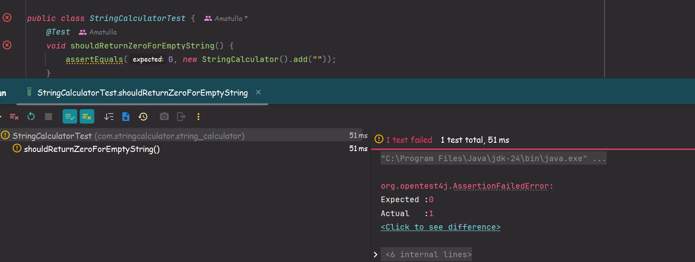
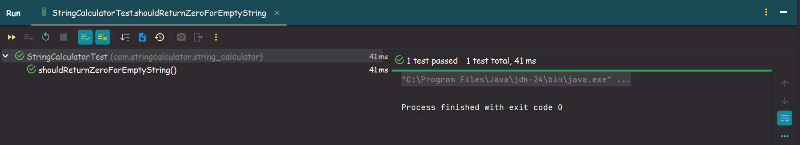
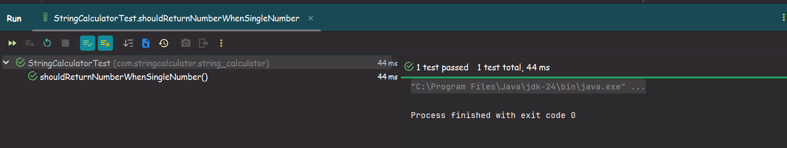
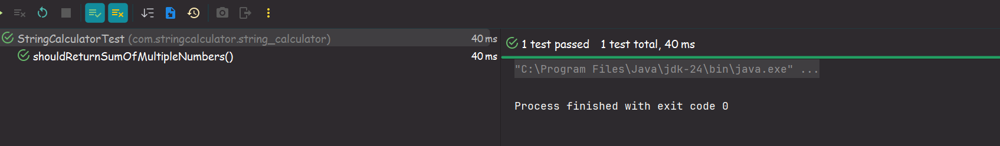
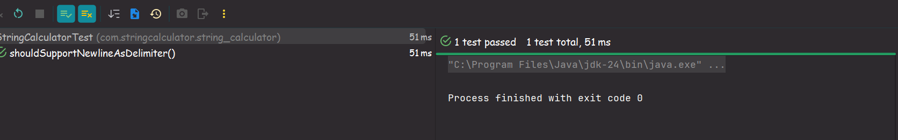
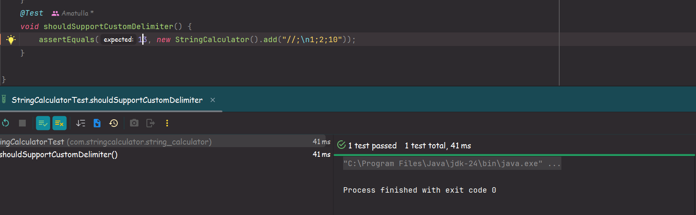
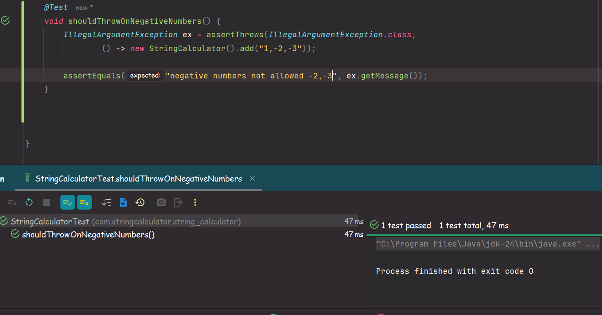
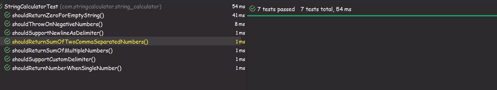

# 🧪 String Calculator – TDD Implementation in Java

This repository contains my implementation of the **String Calculator**, developed using the principles of **Test-Driven Development (TDD)** with **Java** and **JUnit 5**.  
It demonstrates clean coding practices, step-by-step testing, and iterative refactoring aligned with real-world TDD workflows.

---

## 📋 Problem Statement

Implement a method:

```java
int add(String numbers)
```

### Functionality:
- An empty string returns `0`
- A single number returns the value itself
- Two comma-separated numbers return their sum
- New lines (`\n`) can be used as separators, in addition to commas
- Support custom delimiters defined like: `"//;\n1;2"`
- Calling `add` with negative numbers throws an exception:
  ```
  negative numbers not allowed -2,-3
  ```

---

## ✅ Features Completed

| Step | Feature |
|------|---------|
| 1 | Handle empty string input |
| 2 | Handle a single number |
| 3 | Support two or more comma-separated numbers |
| 4 | Support newline `\n` as a valid delimiter |
| 5 | Support custom delimiter format: `//[delimiter]\n` |
| 6 | Throw exception for negative numbers, with all negatives listed |

---

## 🚀 Tech Stack

- Java 21
- JUnit 5
- Maven

---


---

## 🧠 TDD Process (Red → Green → Refactor)


| Step | Description | Screenshot |
|------|-------------|------------|
| 1 | Failing test for empty string input |  |
| 2 | Passing test for empty string |  |
| 3 | Single number support |  |
| 4 | Multiple number support |  |
| 5 | Support for newline as delimiter |  |
| 6 | Support for custom delimiter |  |
| 7 | Negative number exception thrown |  |
| 8 | All tests passed (Final Result) |  |


---


## 🧾 Code Structure

```
src/
├── main/java/com/stringcalculator/string_calculator/
│   └── StringCalculator.java
├── test/java/com/stringcalculator/string_calculator/
│   └── StringCalculatorTest.java
```

---

## 🔁 Commit Strategy

This project uses **7 atomic commits**, one for each TDD step. Each commit reflects:
- A test case added
- A passing implementation
- A clean refactor (if needed)

> This demonstrates a clear, disciplined TDD workflow.

---


## ✍️ Author

[**Amatulla Gajipurwala**](https://github.com/Amatullagajipurwala)


---

